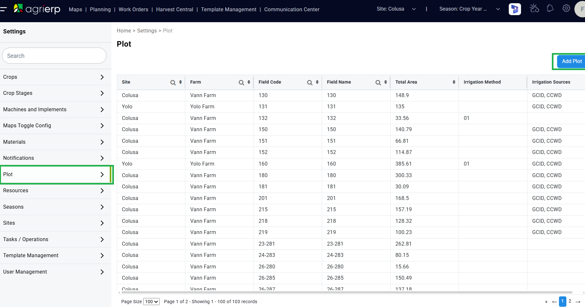
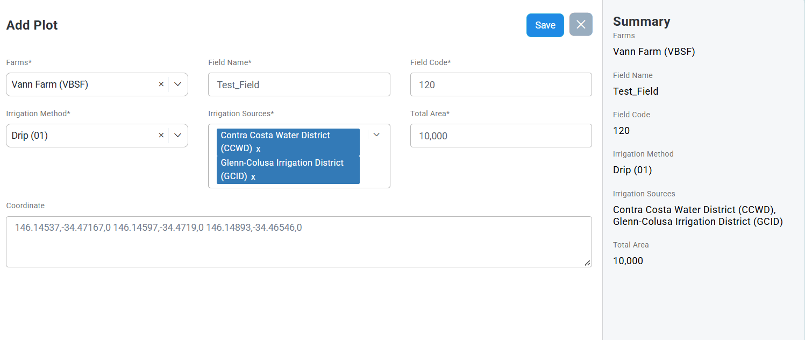

# Plots / Fields — Settings > Plot

Plots (a.k.a. **fields**) are the land units work orders execute against. They are maintained in the
Farm App under **Settings → Plot**, and they sync both ways with D365 F&O (FinOps).

A **plot** and a **field** are the same entity: the web app calls it a *Plot*, FinOps calls it a
*Plot/Field*. The list and form use `Field Name` / `Field Code` for the identity columns.

## Navigation

**Settings** gear → left nav **Plot** → `/settings/plot`. Breadcrumb: `Home > Settings > Plot`,
page heading **Plot**.

The list is scoped by the header **Site** selector (e.g. `Colusa`), so switching site changes the rows.

### List columns

`Site` · `Farm` · `Field Code` · `Field Name` · `Total Area` · `Irrigation Method` · `Irrigation Sources`

- `Site`, `Farm`, `Field Code`, `Field Name` each have a search icon and a sort toggle.
- `Total Area` is sortable only.
- Footer: `Page Size` selector (default `100`) and `Page N of M - Showing X - Y of Z records`.
- `Irrigation Method` shows the code only (e.g. `01`) in the list; the form shows the full label.
- `Irrigation Sources` shows comma-joined abbreviations (e.g. `GCID, CCWD`).

## Creating a plot — Add Plot

**Add Plot** (blue button, top right of the Plot list) opens the **Add Plot** form.

| Field | Required | Control | Example |
|---|---|---|---|
| `Farms*` | yes | single-select | `Vann Farm (VBSF)` |
| `Field Name*` | yes | text | `Test_Field` |
| `Field Code*` | yes | text | `120` |
| `Irrigation Method*` | yes | single-select | `Drip (01)` |
| `Irrigation Sources*` | yes | multi-select (removable chips) | `Contra Costa Water District (CCWD)`, `Glenn-Colusa Irrigation District (GCID)` |
| `Total Area*` | yes | numeric | `10,000` |
| `Coordinate` | **no** | textarea | `146.14537,-34.47167,0 146.14597,-34.4719,0 146.14893,-34.46546,0` |

- Every field except `Coordinate` is marked with `*`. **A plot can be saved without coordinates.**
- `Coordinate` takes `longitude,latitude,altitude` triples separated by spaces — one triple per
  polygon vertex, the same shape the maps layer consumes.
- Selects render a `×` clear affordance next to the chevron; `Irrigation Sources` chips each carry
  their own `x`.
- A right-hand **Summary** panel mirrors the entered values (Farms, Field Name, Field Code,
  Irrigation Method, Irrigation Sources, Total Area) as they are typed.
- Actions: **Save** (blue) and **X** (close without saving).

## Sync with FinOps (D365)

Plot creation is not local to the web app — it round-trips through D365:

1. A plot saved in the web app is picked up by the **PlotJobField** batch service and lands in FinOps
   under **AgriERP management > Plots/Fields**.
2. Projects created in FinOps against those plots sync back to the web app:
   **Project management and accounting > All Projects > New**, then set **Project Stage**
   (Maintain tab) to **InProcess**. The project then appears in the web app.
3. Progress is observable in the FinOps **sync console**, which timestamps each synced record.

If a new plot is missing from FinOps, check that **PlotJobField** is active and compare the sync
console's latest timestamp against the creation time before treating it as an app-side defect.

## Source

Settings > Plot list and Add Plot form captured from ADO
[#26093](https://dev.azure.com/AgriERPProduct/Vann%20Brothers/_workitems/edit/26093) (2026-09-11,
Colusa site). Full work-item record, acceptance criteria, and QA history:
`resources/work-items/26093-create-field.md`.
