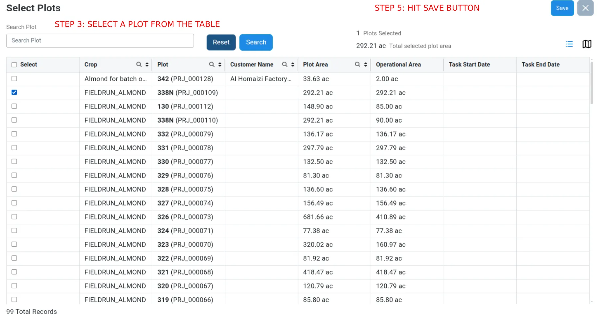

# Work Orders — Planned (standard) flow

Creating a **Planned (standard)** Work Order: a non-tank-mix operation with plots, materials (Rate per acre), resources, and assets. Shared facts (lifecycle, list, common form fields, approval, toasts) live in [`work-orders.md`](./work-orders.md). Live-verified end to end on QA (2026-06-10; produced `WO-640`).

## Flow

1. Log in (VannBrosPhaseTwo web URL).
2. **Work Orders** tab → **Create New Work Orders**. Confirm form title **`Create New Work Order`** + green **`Planned`** chip.
3. Enter **Work Order Name** and set **Priority** (e.g. `High`). Dates default to a valid window.
4. Select **Farm** (e.g. `Vann Farm (VBSF)`).
5. Set **Operation** to a **non-tank-mix** operation (e.g. `Fertilization (1240)`). `Operation Type` stays `Planned`. Selecting Farm + Operation enables the `Add Plot` button.
6. **Select Plot** → click **`+` (`Add Plot`)** (re-verified 2026-08-26; formerly labelled `Add Block`) → **Select Plots** modal → tick plot row(s) → **`Save`**. (See screenshot below — screenshot predates the label/heading rename but the flow is unchanged.)
7. **Select Materials** → **`+` (`Add Material`)** → **Select Materials** modal → tick material(s) → **`Save`** → set **Rate** (applied **per acre**) in the grid.
8. **Select Resources** → **`+` (`Add Resources`)** → **Select Resources** modal → tick resource(s) → **`Save`**.
9. **Select Assets** → **`+` (`Add Asset`)** → **Select Assets** modal → tick machine/implement → **`Save`**.
10. Select **Supervisor** **last** (e.g. `Agrierp 02 (02)`) — earlier picks get wiped by the section-save re-renders.
11. **Submit** → **`Create Work Order`** confirm dialog (`Are You Sure You Want To Save The Work Order`) → **`Save`**.
12. Success toast: `Work Order WO-XXXXX | <name> Saved Successfully`; new row in list at **To Do / Queue**.

## Screens

*Create form. STEP 1 = fill Name / dates / Priority / Farm / Operation Type (`Planned`) / Operation / Supervisor. STEP 2 = the `+` (`Add Plot`) button opens the plot picker modal. The form also renders an inline "Select Plot" table with its own `Task Date Range` / `Select Range` date filter — as of 2026-08-26 that filter is broken (stuck at `Jan 1 1900`, no selectable day) and unrelated to/not required by the `Add Plot` modal flow; screenshot predates this addition.*

*`Select Plots` modal (screenshot/asset predates the heading rename from `Select Blocks`; flow unchanged). STEP 3 = tick a plot row (header checkbox is select-all — avoid it). STEP 4 = `Save`. Shows `N Total Plots` + total area.*

## Selection modals (live columns)

- **Select Plots** (plot; re-verified 2026-08-26, columns renamed from the `Select Blocks` wording below): `Select`, `Plot` (e.g. `342 (PRJ_000128)`), `Customer Name`, `Plot Area`, `Operational Area`, `Effective Area`, `Start Date`, `End Date`. Footer: `N Total Plots`. Searchbox column filters per-column (no single `Search Block` box observed live).
- **Select Materials**: searchbox `Search By Material Name` + `Apply` / `Reset`; rows `<Material Name> (code)` with checkbox. After save, grid columns `Material`, `Rate` (spinbutton, default `1`), `Usage Unit` (e.g. `gal`), `Action` (`Replace Material`, `Remove Material`).
- **Select Resources**: `Resource Group` dropdown (default `All`; Machine Operators, Farm Hands), searchboxes `Search By Resource Name` / `Search By Company Name`, `Apply` / `Reset`. Rows `<Resource Name> (code) <Resource Type>`. `By Resource` radio on the form section. Grid: `Resource Name`, `Resource Type`, `Company Name`, `Action`.
- **Select Assets**: `Resource Group` dropdown (default `All`), searchbox `Search By Asset Name`, `Apply` / `Reset`. Rows `<Asset Name> (code)`. Grid: `Asset Name`, `Asset Type`, `Resource Group`, `Action`.

## Notes / pitfalls (verified live 2026-06-10)

- **`Add Plot` vs `Select Range`:** plots are added via the **`+` (`Add Plot`)** button (formerly `Add Block`) → modal. The inline `Task Date Range` / `Select Range` filter is a separate date filter; as of 2026-08-26 it shows a dead calendar (only `Jan 1 1900`, month-nav disabled, min=max) and is not required to add a plot or submit — do not touch it.
- **Section gating:** `Add Material` / `Add Resources` / `Add Asset` are inert until **Farm + Operation + Plot** are set.
- **Supervisor last:** section saves re-render the form and wipe an early Supervisor pick → Submit stays disabled.
- **Submit ≠ save:** Submit opens the `Create Work Order` dialog; its `Save` persists.
- **Plot data-coupling:** the operation must have a plot schedule in the date window. `Almond Preparartion (1290)` had **0** selectable blocks in Crop Year 2026; `Fertilization (1240)` had **99**.
- **Header checkbox** in selection modals is a select-all — tick a body row, not the header.
- **Automated:** see `playwright/tests/authenticated/work-orders.spec.ts` (`@mutating` spec) and `playwright/test-plans/authenticated/work-orders.md` (TC-1).
