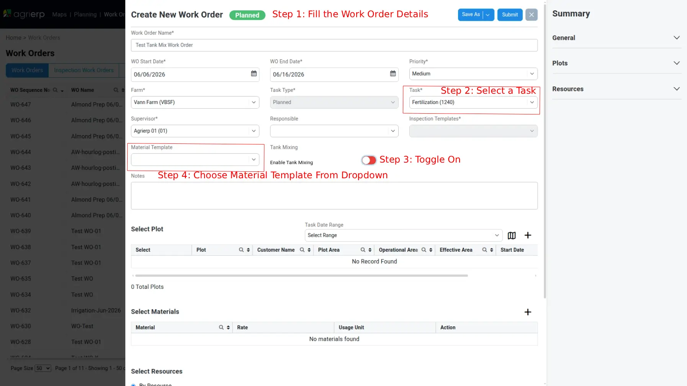
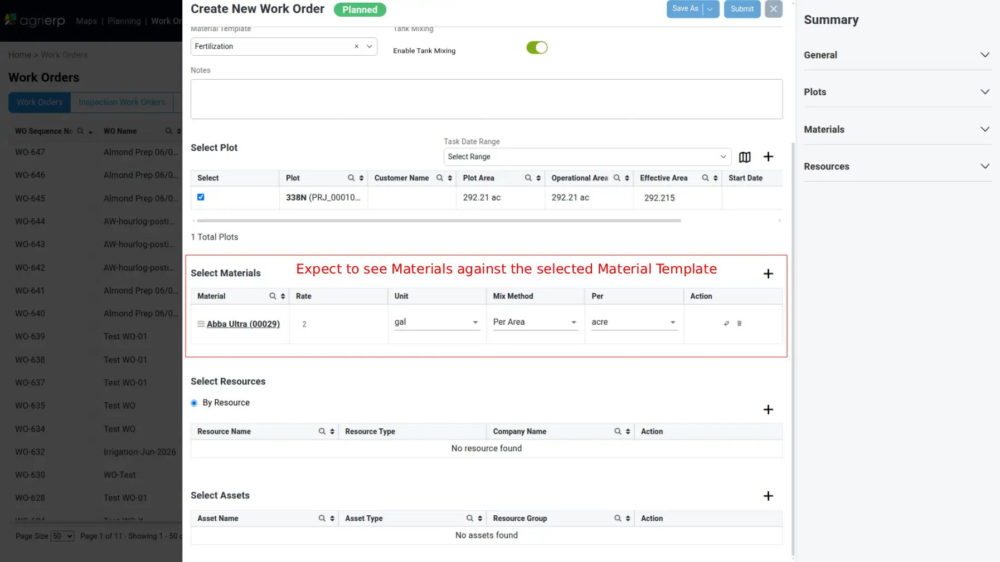

# Work Orders — Tank Mix flow

Creating a **Tank Mix** Work Order: a tank-mix task where materials carry Unit / Mix Method / Per and Liquid Application params. Shared facts (lifecycle, list, common form fields, approval, toasts) live in [`work-orders.md`](./work-orders.md). Standard-flow mechanics (the `+ Add Plot` plot picker, section gating, Supervisor-last, Submit→confirm dialog) match [`work-orders-planned.md`](./work-orders-planned.md).

It is authored on the same **Create New Work Order** form as Planned (green **Planned** chip). On this form:

- **Task Type\*** is **disabled** (fixed to `Planned`).
- **Inspection Templates\*** is **disabled**.
- **Enable Tank Mixing** toggle drives the tank-mix Material columns (confirmed live 2026-06-10; OFF → `Rate` + `Usage Unit`, ON → `Mix Method` / `Per` / `Unit`).

## Flow (template-driven — primary path)

1. **Work Orders** → **Create New Work Orders**. Fill **Work Order Name\***, **WO Start/End Date\***, **Priority**, **Farm\***, **Supervisor\***.
2. Select **Task\*** (e.g. `Fertilization (1240)`). **Tasks are bound to Material Templates — the Task must be picked before the Material Template**, or the template list is empty.
3. Toggle **Enable Tank Mixing** ON. **Order matters: do this AFTER the Task** — selecting a Task **resets the toggle OFF**, so toggling first leaves tank mixing disabled and the Material Template dropdown empty.
4. Select a template in the **Material Template** dropdown → an **Alert** `Are you sure you want to apply material template?` appears → tap **Yes**.
5. The **Select Materials** section auto-populates from the template — each row carries `Material`, `Rate`, `Unit`, `Mix Method`, `Per` **and** the per-material Liquid Application details, so **no manual material entry is needed**.
6. **Select Plot** `+ (Add Plot)` → tick plot(s) → `Save`. **Select Resources** + **Select Assets** as standard.
7. **Submit** → `Create Work Order` confirm dialog → `Save`. After mobile execution: **Work Order Completed** → Approve → **Done**.

### Without a template (manual path)

`+ (Add Material)` on **Select Materials** → modal → check materials → `Save` → set `Rate`, `Unit`, `Mix Method`, `Per` per row. The material-row controls are Angular Material **`<mat-select>`** overlays (NOT native `<select>`): **Unit** (defaults, e.g. `gal`), **Mix Method** (empty), **Per** (disabled until Mix Method is set). Then open each material's **Tank Mixing → Edit Tank Mixing Details** and fill the Liquid Application params. This path hits two mandatory gates the template path avoids:

- Leaving Mix Method / Per empty → Submit alert **`Please Fill All Details For Materials`**.
- Missing Application detail → Submit alert **`Application detail is mandatory for this work order : <name>`** (the Liquid Application detail is **mandatory**, not optional).

## Materials grid (tank mix)

`Material`, `Rate`, `Unit` (e.g. `gal`, `fl. oz`), `Mix Method`, `Per` (`Per Area`/acre, `Per Volume`/100 gal), `Action`. Example auto-filled row: `Abba Ultra (00029)`, Rate `2`, Unit `gal`, Mix Method `Per Area`, Per `acre`.

## Edit Tank Mixing Details (Liquid Application)

`Application Method` (e.g. Air-blast Sprayer, Air-Aid Sprayer), `Total Application Rate (gal/ha)`, `Tank Size (gal)`, `Nozzle Type` (e.g. Air Induced), `Droplet Size` (e.g. Very Fine), `Preharvest (PHI) (days)`. Right panel `Additional Details` shows `Application Type` (e.g. Liquid). Via the template path these come pre-filled.

## Verified live (2026-06-11, VBS tenant)

- Form: Task Type\* + Inspection Templates\* disabled; **Enable Tank Mixing** ON surfaces Mix Method / Per / Unit columns. Example Task `Fertilization (1240)`, Farm `Vann Farm (VBSF)`.
- **Toggle order:** selecting a **Task resets the Enable Tank Mixing toggle OFF** — always pick the Task first, then toggle ON, else the Material Template dropdown stays empty. Full create→submit verified live 2026-06-11 (WO created, success toast) once the order was corrected.
- The **Material Template** dropdown is the app's custom `.dropdown` (`#myDropdown` menu, sticky `#searchTextbox`, sibling option rows) — **not** a `<mat-select>`.
- The template list is **scoped to the active Site/Season + Task** and can be **empty** even when a template exists in another season. The Playwright specs therefore `test.skip` when the dropdown has zero options, keeping the suite green regardless of QA data state.

## Notes

- Cross-reference: building tank-mix materials uses the *Create Material Template* manual (see `templates.md`).
- **Rate is per acre** for the standard part; tank-mix adds Mix Method / Per (Per Area vs Per Volume).
