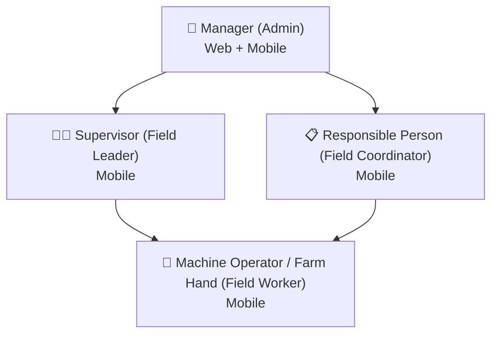

# User Roles

VannBrosPhaseTwo defines five primary functional roles for role-based access control. The roles are the conceptual model; concrete access is configured per tenant as **User Roles** with permission checkboxes (see [Set up users, roles & groups](../administration/set-up-users-roles-groups)).

## Manager — Web + Mobile, Administrative

The administrative role with full control.

- Create and manage work orders
- Review & approve/reject user attendance *(if attendance is enabled)*
- Adjust attendance & break hours *(if attendance and break hours is enabled)*
- Assign responsible persons to work orders
- Create material & inspection templates
- Modify farm planning (crop, resources, material updates)
- Generate & manage harvest work orders *(if harvesting is enabled)*
- Assign and review machine operators & field hands
- Approve field-progress adjustments
- Manage role-based user permissions & access control
- Create and modify attributes
- Toggle the responsible-person designation (one per work order at a time)
- Retain edit rights on progress in the Farm App

## Supervisor — Mobile, Field Leadership

Oversees field operations from the mobile app.

- Start and end work orders for self and others
- Clock in/out other users *(if attendance is enabled)*
- Assign & adjust machine operators and farmhands
- Review & update field progress
- Generate & assign harvest tickets *(if harvesting is enabled)*
- Approve or modify task completions
- Switch/select other users or machines from mobile
- Adjust and modify users' progress
- Participate in multiple active work orders simultaneously
- Remove and assign a new responsible person

## Responsible Person — Mobile, Field Coordinator

One designated coordinator per work order, accountable for its completion.

- **Single designated person per work order**
- Enter progress updates and task completions
- Clock in/out assigned resources *(if attendance is enabled)*
- Add or remove team members or machinery from work orders
- Can start a work order even if not clocked in
- Maintain task accountability
- Add or remove team leads

:::note
A **Team Lead** is named in the role overview as a field-lead grouping, assigned/removed by the Responsible Person or Supervisor.
:::

## Machine Operator / Farm Hand — Mobile, Field Worker

The core execution roles in the field.

- Clock in/out for daily attendance
- Start assigned jobs and tasks
- Add progress updates
- Record material consumption
- Pause and resume jobs
- Mark daily progress and task completion
- Chat with field staff and management
- Create observations & points of interest

## Feature toggles

Several permissions are gated by per-tenant feature toggles — for example *(if attendance is enabled)*, *(if attendance and break hours is enabled)*, and *(if harvesting is enabled)*. If a capability is missing for a role, check whether the relevant feature is enabled for the tenant.

:::tip Web vs Mobile
Only the **Manager** has web access among the primary roles. Supervisors, Responsible Persons, and Operators/Farm Hands work on **mobile**. Work orders are authored and approved on web but executed on mobile.
:::
