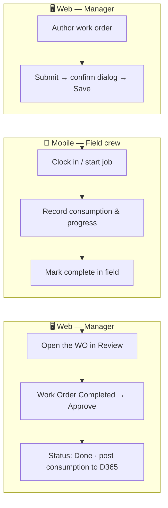
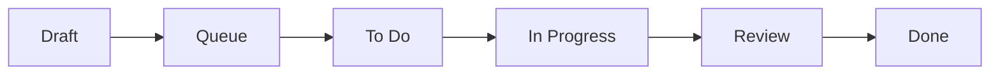
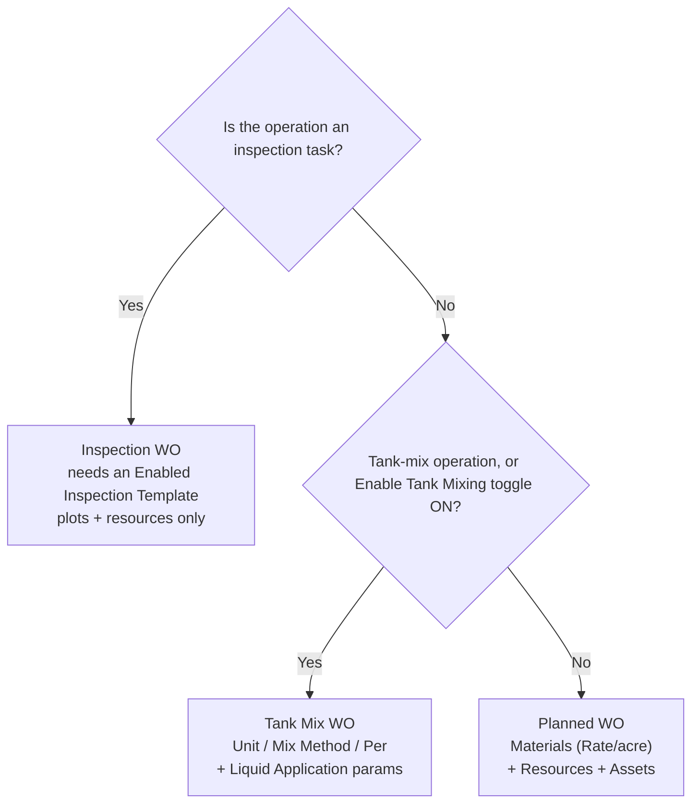

# Work Order Lifecycle

A **work order (WO)** is the unit of planned field work in VannBrosPhaseTwo. It binds a task/operation, a farm and plots, a date range, a priority, a supervisor (and optional responsible person), and — depending on type — materials, resources, and assets.

## Web authors, mobile executes, web approves

This split is the single most important thing to understand about work orders:

- **Web** — a Manager **authors and submits** the work order, and later **approves** it.
- **Mobile** — field workers **execute** it: clock in, start the job, record consumption, update progress.
- **Approval on web is the only path to `Done`**, and it posts material & machine consumption to the ERP.

## Statuses

The Work Orders list filters by these status chips:

`All | Queue | Draft | To Do | In Progress | Review | Done | Filter`

| Status | Meaning |
|---|---|
| **Draft** | Saved but not submitted (via **Save As**). |
| **Queue / To Do** | Submitted **and confirmed** (Submit → confirm dialog → **Save**); queued for the field. Visible on mobile. |
| **In Progress** | Being executed on mobile. |
| **Review** | Completed in the field, awaiting approval on web. |
| **Done** | Approved on web. Consumption is posted to the ERP. |

## The three work-order types

All three are created from the **Work Orders** screen; they differ only by the **Task / Operation** you choose (and the **Enable Tank Mixing** toggle).

| Type | Pick a task that is… | Distinctive parts | Guide |
|---|---|---|---|
| **Planned (standard)** | NOT a tank-mix operation | Materials (Rate per acre), Resources, Assets | [Create a Planned Work Order](../user-journeys/work-orders/create-planned-work-order) |
| **Tank Mix** | a tank-mix operation | Materials with Unit / Mix Method / Per + Liquid Application params; optional Material Template | [Create a Tank Mix Work Order](../user-journeys/work-orders/create-tank-mix-work-order) |
| **Inspection** | an inspection operation | Requires an Enabled Inspection Template; plots + resources only (no materials/assets) | [Create an Inspection Work Order](../user-journeys/work-orders/create-inspection-work-order) |

## Approval & posting

When a work order reaches **Review**, a Manager opens it (eye icon), clicks **Work Order Completed**, and confirms in the **Approve this Work Order** dialog. The status changes to **Done** and any recorded material and machine consumption is posted to the ERP — where it later surfaces as posted journals in Dynamics 365.

See [Approve a Work Order](../user-journeys/work-orders/approve-work-order) and [Review Postings](../finance/review-postings).

:::warning One responsible person
A work order has at most **one Responsible Person** at a time. Only a Manager can toggle that designation.
:::
