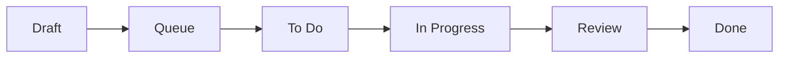

# Work Order Diagrams

A visual reference for the VannBrosPhaseTwo work-order flows. Each diagram below is also embedded inline in the relevant guide; this section collects them in one place for quick reference.

| Diagram | Shows |
|---|---|
| [Lifecycle (state)](#lifecycle-state) | The status flow `Draft → Queue → To Do → In Progress → Review → Done`. |
| [Web ↔ Mobile ↔ Web](./web-mobile-web) | Who does what, where: web authors & submits, mobile executes, web approves & posts. |
| [Create flow & type decision](./work-order-create-flow) | The create steps per type, and how to pick the work-order type. |
| [Approval sequence](./work-order-approval) | `Review → Work Order Completed → Approve → Done` and the post to Dynamics 365. |

## Lifecycle (state) {#lifecycle-state}

The Work Orders list filters by these status chips: `All | Queue | Draft | To Do | In Progress | Review | Done | Filter`.

| Status | Meaning |
|---|---|
| **Draft** | Saved but not submitted (via **Save As**). |
| **Queue / To Do** | Submitted and confirmed; queued for the field. Visible on mobile. |
| **In Progress** | Being executed on mobile. |
| **Review** | Completed in the field, awaiting approval on web. |
| **Done** | Approved on web. Consumption is posted to the ERP. |

See the [Work Order Lifecycle](../concepts/work-order-lifecycle) concept page for the full narrative.
