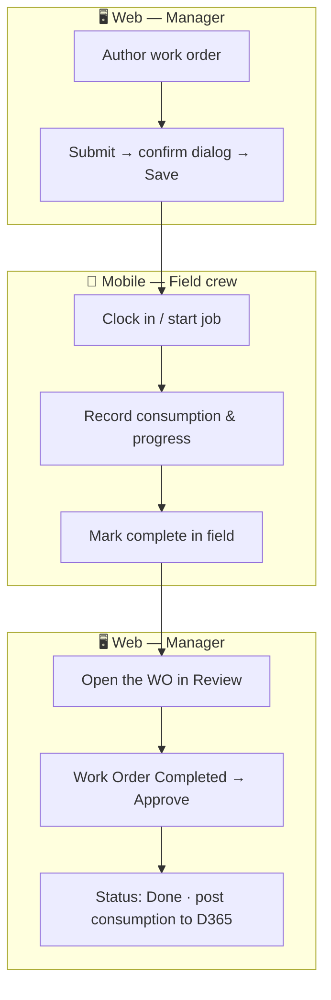

# Web authors, mobile executes, web approves

The single most important thing to understand about work orders: a Manager **authors and submits** on web, field crews **execute** on mobile, and a Manager **approves** on web. Approval is the only path to `Done`, and it posts material & machine consumption to Dynamics 365.

- **Web** — author, submit (and confirm), and later approve.
- **Mobile** — only WOs that were submitted **and confirmed** appear; the field crew executes them.
- **Approval on web** is the only path to `Done`; it posts consumption to the ERP, where it surfaces as posted journals in Dynamics 365.

Related: [Work Order Lifecycle](../concepts/work-order-lifecycle) · [Approve a Work Order](../user-journeys/work-orders/approve-work-order).
