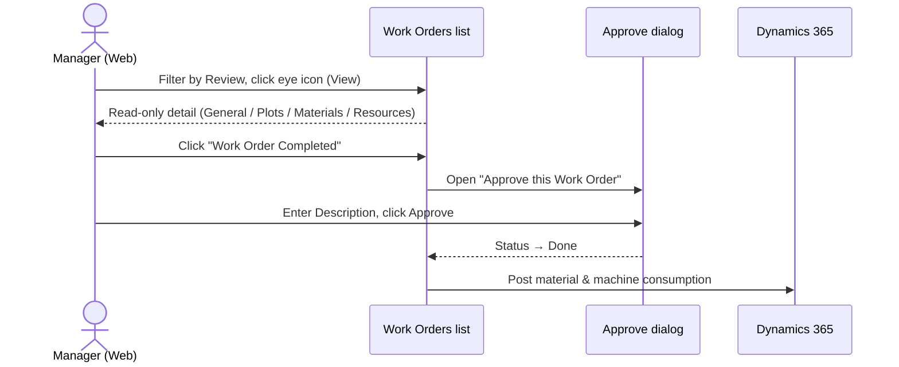

# Approval sequence

After a WO is completed in the field on mobile it lands in **Review**. A Manager opens it on web, marks it completed, and approves it. Approval moves it to **Done** and posts material & machine consumption to Dynamics 365.

Related: [Approve a Work Order](../user-journeys/work-orders/approve-work-order) · [Review Postings](../finance/review-postings).
