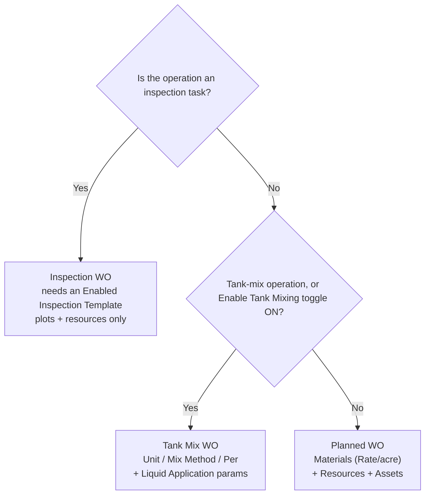
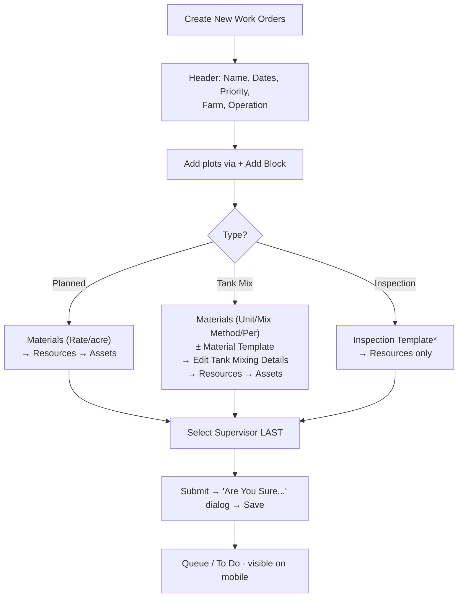

# Create flow & type decision

## Which work-order type?

All three types are created from the **Work Orders** screen and differ only by the **Operation / Task** you choose (and, for tank mix, the **Enable Tank Mixing** toggle).

## Create steps

The header and plot steps are common; the middle section differs by type. **Submit opens a confirm dialog — the dialog's `Save` is what persists the WO.** Select the **Supervisor last**: a section save re-renders the form and wipes an early Supervisor pick.

Related guides: [Planned](../user-journeys/work-orders/create-planned-work-order) · [Tank Mix](../user-journeys/work-orders/create-tank-mix-work-order) · [Inspection](../user-journeys/work-orders/create-inspection-work-order).
