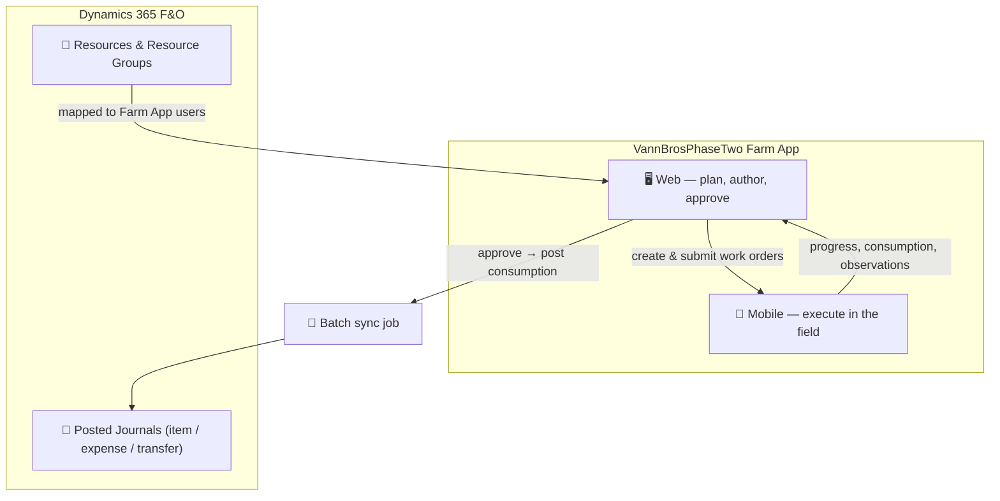

# VannBrosPhaseTwo

  

 

**VannBrosPhaseTwo** is Folio3's state-of-the-art agriculture ERP. It runs day-to-day farm operations — planning and dispatching field work, capturing what happened in the field, and posting the resulting labor, material, and inventory movements into the back-office ledger.

## The two systems

VannBrosPhaseTwo spans two cooperating systems. Understanding the split is the key to everything else in these docs.

| System | Surface | What it does |
|---|---|---|
| **VannBrosPhaseTwo Farm App** | **Web** + **Mobile** | Web: planning, authoring & approving work orders, template management, user management, communication, maps. Mobile: field execution — clock in/out, start/end jobs, record consumption, create observations. |
| **Microsoft Dynamics 365 Finance & Operations (D365 F&O)** | Back office | Defines resources & resource groups; receives VannBrosPhaseTwo-synced consumption and inventory movements as posted journals. |

A **batch job** syncs VannBrosPhaseTwo field activity (material/expense consumption, inventory dispatch and returns) into D365, which posts the corresponding journals for review.

## The core loop

Most work in VannBrosPhaseTwo flows through the **work order** lifecycle:

1. A **Manager** (web) creates and submits a work order against a farm, plots, task, and resources.
2. The work order appears on **mobile**, where field workers execute it — clocking in, recording material consumption, and updating progress.
3. The Manager **approves** the completed work order on web. Approval is the only path to `Done`, and it posts material & machine consumption to the ERP.
4. The sync **batch job** lands those postings in **D365** as item/expense/transfer journals, where finance reviews them.

See [Work Order Lifecycle](./concepts/work-order-lifecycle) for the full status model.

## Who uses VannBrosPhaseTwo

Five primary roles drive role-based access — from the **Manager** (full administrative control on web + mobile) down to the **Machine Operator / Farm Hand** (mobile field execution). See [User Roles](./concepts/roles) for each role's permissions.

## Where to go next

- **New to the product?** Start with [Core Concepts](./concepts/roles) — roles, terminology, and the work-order lifecycle.
- **Doing the work?** Browse the [User Journeys](./user-journeys/) — step-by-step guides for work orders, templates, observations, and communication.
- **Setting up access?** See [Administration](./administration/set-up-users-roles-groups) — users, roles, groups, and resources.
- **In finance?** See [Finance & Journals](./finance/review-postings) — reviewing posted journals in D365.

:::note Source of truth
These docs are derived from the VannBrosPhaseTwo product manuals (V1.0). Where the live application differs from what is written here, **the live application is correct** — please report the drift so the docs can be updated.
:::
