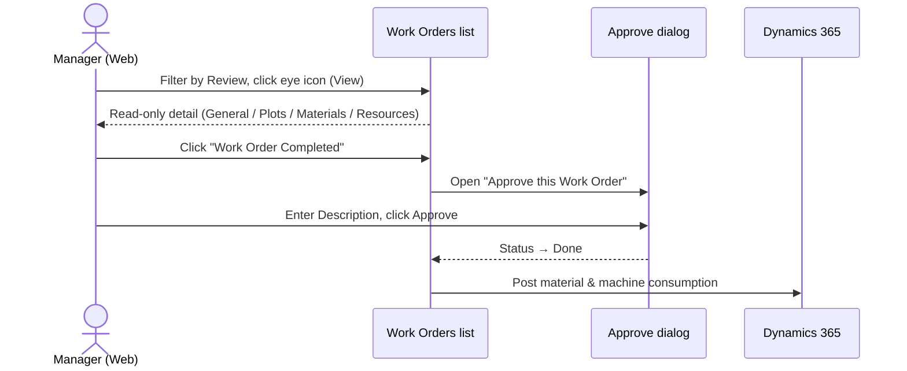

# Work Orders: Approve a Work Order

**Who:** Manager (a [role](../../concepts/roles) with work-order approval rights)  **Where:** Web

Approval is the final step in the [work order lifecycle](../../concepts/work-order-lifecycle). After a WO has been completed in the field on mobile, a Manager reviews it on web and approves it. **Approval is the only path to `Done`** and it **posts material and machine consumption to the ERP**.

## Before you start

:::note Prerequisites
- A Manager account with work-order approval rights.
- The WO has been completed in the field on mobile and is in the **Review** state.
:::

Work orders are reviewed and approved from the Work Orders list at `https://vannbrosphasetwo-<client>-<env>.folio3.site/workorders`.

## Steps

1. Log in to VannBrosPhaseTwo web and go to the **Work Orders** tab. Filter by the **Review** status chip to find completed WOs.
2. Select the WO and click the **eye icon** (View) to open its read-only detail.
3. Review the detail. The right panel shows `General`, `Plots`, `Materials`, and `Resources`. Read-only fields include `Start Date`, `End Date`, `Progress`, `Supervisor`, `Farm`, `Work Order Type`, `Task Type`, `Task`, `Crop Stage`, `Assets`, `Material Template`, `Inspection Template`, `Submitted By`, `Responsible`, `Created By`, `Notes`, and `Approve Comments`. The Plots grid shows `Plot`, `Customer Name`, `Progress`, `Crop Variety`, `Total Area - ac`, `Operational Area - ac`, `Spent Hours`, and `Attachments` (open via **View Attachment(s)**).
4. Click **Work Order Completed** (top-right; "Mark as Completed").
5. In the **Approve this Work Order** dialog, enter comments in the **Description** field (placeholder `Enter Text`).
6. Click **Approve** (or **Cancel** to abort).

## Result

The work order status will change to **`Done`**, and any material and machine consumption recorded will be **posted to ERP**.

## Notes & gotchas

:::warning Approval is irreversible posting
Approving posts consumption to the ERP. Review the **Materials** and **Resources** detail and any plot **Attachments** before clicking **Approve**.
:::

- Approval is the **only** way a WO reaches `Done` — field completion on mobile only moves it to `Review`.
- Inspection WOs follow the same approval path (they carry no material/machine consumption, but still require approval to reach `Done`).
- The comments you enter in **Description** are stored on the WO as `Approve Comments`.
- Related authoring flows: [Planned](./create-planned-work-order), [Tank Mix](./create-tank-mix-work-order), and [Inspection](./create-inspection-work-order) work orders.
- See the [approval sequence diagram](../../diagrams/work-order-approval) for the full flow at a glance.
