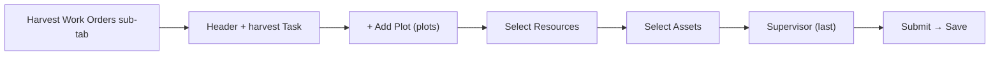

# Work Orders: Create a Harvest Work Order

**Who:** Supervisor / Manager (a [role](../../concepts/roles) with work-order authoring rights)  **Where:** Web (authored & submitted on web; executed on mobile)

A **Harvest Work Order** schedules harvest-season field work — shaking, pickup, hulling, conditioning — against a farm and its plots. It is created from its own **Harvest Work Orders** sub-tab, and its **Task** list is restricted to the five harvest operations. Like a [Planned WO](./create-planned-work-order) it captures **plots, resources, and assets**, but it has **no materials step and no tank mixing**. You author and submit it on web; crews execute it on mobile; a [Manager approves it](./approve-work-order) to reach `Done`.

## Before you start

:::note Prerequisites
- A user account with permission to create work orders.
- **Harvesting enabled for your tenant.** Several harvest capabilities are gated by a feature toggle — *(if harvesting is enabled)* — and the `Manage Harvest Ticket` / `Manage Harvest ID` work-order permissions. Without it the sub-tab may not appear.
- A farm with plots scheduled in your date window.
:::

Harvest WOs are created from the **Harvest Work Orders** sub-tab of the Work Orders list at `https://vannbrosphasetwo-<client>-<env>.folio3.site/workorders`.

## The harvest tasks

The **Task\*** dropdown on this form offers only these five operations — this is what makes the work order a harvest WO:

| Task | Code |
|---|---|
| `Harvest` | 1610 |
| `Hulling & Drying` | 1620 |
| `Shaking` | 1630 |
| `Conditioning` | 1640 |
| `Pickup` | 1650 |

## Steps

1. Log in to VannBrosPhaseTwo web and go to the **Work Orders** tab.
2. Open the **Harvest Work Orders** sub-tab.
3. Click **Create New Work Orders** (top-right).
4. Fill in the header fields:
   - **Work Order Name\***
   - **WO Start Date\*** and **WO End Date\***
   - **Priority\*** — `Low`, `Medium` (default), `High`, or `Urgent`
   - **Farm\***
   - **Task Type\*** — pre-set to `Planned` and **not editable** on this form
   - **Task\*** — one of the five harvest operations above
   - **Supervisor\*** — the resource who manages the WO. **Select this last** (see gotchas); skip it for now.
   - **Responsible** — optional
   - **Notes** — optional
5. Add plots under **Select Plot\***: click **`+ Add Plot`** → **Select Plots** modal → check plots → **Save**. The modal shows `Crop`, `Plot`, `Customer Name`, `Plot Area`, and `Operational Area`, and tracks a running `N Plots Selected` / total selected area.
6. Assign resources under **Select Resources**: choose **By Resource** or **By Groups**, click **+**, pick from the modal, then **Save**.
7. Add machines and implements under **Select Assets**: click **+**, pick from the modal, then **Save**.
8. Now select the **Supervisor\*** (skipped in step 4), click **Submit**, then click **Save** in the **Create Work Order** confirm dialog.

:::warning Submit is not Save — and pick Supervisor last
**Submit** only opens the confirm dialog; its **`Save`** persists the WO. A section save re-renders the form and **wipes an early Supervisor pick** (leaving Submit disabled) — choose the Supervisor **last**.
:::

:::tip
Use **Save As** in the form header to save a `Draft` instead of submitting. Drafts show an empty **Submitted By** and are not visible on mobile.
:::

:::caution Don't use the `Select Range` filter
The **Task Date Range / Select Range** picker next to `+ Add Plot` is a date filter, not the plot selector, and is currently unusable (no selectable day). It is **not required** — add plots through the **`+ Add Plot`** modal and leave it alone.
:::

## Result

You'll see a success toast (title **`Success`**) like **`Work Order WO-1067 | Test Harvest WO Saved Successfully`**. After you confirm with **Save**, the WO enters the **Queue / To Do** state, appears on the **Harvest Work Orders** sub-tab, and becomes visible on mobile.

## Tracking harvest quantity

Harvest WOs carry two quantity fields that other work-order types don't. Both appear on the read-only **work order detail** view (the **View Work Order Detail** eye icon), populated from mobile execution:

- **`Target Quantity`** — on the **Plots** grid, per plot.
- **`Harvest Quantity`** — on the **Assets** grid, alongside `Asset Usage UOM`.

The detail view also shows `Additional Information` (total plot / operational / effective area), `Plot Details`, a **Weather** log per plot, and the **Plots Map**.

## Approving a harvest work order

Once crews finish in the field the WO reaches `Review`. A Manager opens its detail view and clicks **`Workorder Completed`**, enters a comment, and confirms with **Approve** to move it to `Done`.

:::note Button wording differs here
On harvest work orders the button reads **`Workorder Completed`** (one word) and the row action is **`Delete Workorder`**, where other work-order types use `Work Order Completed` and `Delete Work Order`. The comments field on the detail view is labelled **`Approver Comments`**.
:::

See [Approve a Work Order](./approve-work-order) for the shared approval flow.

## Harvest Central (harvest tickets)

**Harvest Central** is a separate top-nav screen (`/harvest-central`) for harvest **tickets** — not work orders. It lists tickets aggregated per field: `Field`, `Variety`, `No Of Harvest Tickets`, `Updated By`, `Updated By Date`.

To create one, click **Create Harvest Ticket** and complete the form:

- **Read-only context:** `Grower`, `Season`, `Hulling Location`.
- **Required:** `Field*`, `Variety*`, `Driver Name*`, `Truck License Plate*`, `Front Trailer Plate*`, `Rear Trailer Plate*`.
- **Optional:** `Manual Ticket #` (a paper-ticket reference), `Load Type`, `Last Load` / `Split Load`, `Fleet`, `Standard Quantity`, and file attachments.

**`Save Harvest Ticket`** stays disabled until every required field is set. After saving, use **Refresh Data** to see the field's `No Of Harvest Tickets` increase, and the row's **View details** chevron to open the individual tickets.

## Notes & gotchas

:::warning The Task list gates the flow
If you need a non-harvest operation (irrigation, fertilization, …), use the [Planned WO](./create-planned-work-order) flow instead — those tasks are not offered on the Harvest form. Likewise the harvest tasks are not offered on the standard Work Orders tab.
:::

- Harvest WOs are listed **only** on the **Harvest Work Orders** sub-tab, not on the main Work Orders list.
- There is **no** materials step and **no** Enable Tank Mixing toggle — plots, resources, and assets only.
- The `+` buttons for **Select Resources** and **Select Assets** do nothing until a plot has been added; `+ Add Plot` needs **Farm** and **Task** set first.
- The form still shows the green **`Planned`** chip in its title — that's expected; the **Task** is what makes it a harvest WO.
- Only **one Responsible Person** can be set per WO at a time.
- See the [Work Order Lifecycle](../../concepts/work-order-lifecycle) for the full status flow.
