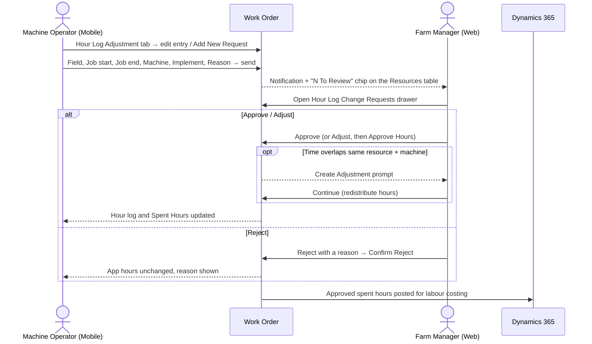

# Work Orders: Hour Log Adjustment

**Who:** Machine Operator (raises the request) and Farm Manager (a [role](../../concepts/roles) with Admin/Manager rights; decides it)  **Where:** Mobile (request) → Web (review)

Hour Log Adjustment replaces verbal hour corrections with a request-and-approval flow. When the hours the mobile app recorded against a work order are wrong, or a run was never recorded at all, the operator raises an **hour log change request** from the work order on mobile. The Farm Manager reviews it on web and chooses **Approve**, **Adjust** or **Reject**. **Nothing is applied without approval:** the hour log stays exactly as the app recorded it until a manager decides.

:::note Where the labels come from
The web (Farm Manager) labels, buttons and messages on this page were verified against the live QA app on 2026-09-28. The mobile steps and the **Create Adjustment** overlap prompt still follow the Hour Log Adjustment product specification (PSD v1.0) mocks and have not been verified live. If the app differs, the app is correct.
:::

## Before you start

:::note Prerequisites
- The Hour Log Change Request feature is **enabled** in the tenant **Feature Set**. When it is disabled, **Add New Request**, **Edit**, **Approve**, **Adjust** and **Reject** are all unavailable.
- The work order is **In Progress**. Once it moves to **Review**, no new request can be raised.
- The operator is a Machine Operator (field staff). The **Hour Log Adjustment** tab is not shown to Supervisor, Admin or Manager roles.
- The manager deciding the request is not the user who raised it (see [self-approval](#notes--gotchas)).
:::

## Raise a request (Machine Operator, mobile)

The **Hour Log Adjustment** tab on the work order shows the approved hours and number of entries at the top, then the entries grouped by field with the count and total per field. Each entry shows only the date, the start and end time and the duration, with an edit and a delete action.

1. Open the work order in the mobile app and go to the **Hour Log Adjustment** tab.
2. Choose the kind of request:
   - To correct an entry the app recorded wrongly, tap the **edit** action on that entry. **Request Hour Change** opens with the app-logged hours shown at the top for reference and the entry's machines and implements already selected.
   - To add a run the app never recorded, tap **Add New Request**.
3. Select the **Field**. Only the fields on that work order are listed.
4. Enter the **Job start** date and time and the **Job end** date and time.
5. Open the **Machine** dropdown and tick every machine the run was made with. The dropdown stays open so you can pick several, and shows `N selected` when more than one is picked.
6. Optionally, open the **Implement** dropdown (searchable, multi-select) and tick the implements run behind the machines.
7. Check the **Duration**. It is calculated by the system and is read-only.
8. Enter the **Reason** and send the request.

The request goes to the manager for approval. The entry itself does not change until the manager decides the request.

### Validation messages

The request cannot be sent until every mandatory field is filled and the times are consistent.

| Rule | Message |
|---|---|
| No field selected | `Select a field.` |
| Job start missing | `Enter the start date and time.` |
| Job end missing | `Enter the end date and time.` |
| No machine selected | `Select at least one machine.` |
| Job end is the same as or earlier than job start (shown under **Job end** as soon as the times are inconsistent, and blocks sending) | `The job end must be after the job start.` |
| No reason | `Add a short reason — your manager needs it to approve.` |

**Implement** is the only optional field.

## Review a request (Farm Manager, web)

1. Go to **Work Orders** and open the work order.
2. On the **Resources** table, find the **Hour Log Changes** column. Resources with requests waiting show an **`N To Review`** chip (for example `2 To Review`). The chip can appear on **Machine** resource rows as well as operators. **Spent Hours** on each line (for example `10h:01m`) always shows the hours currently approved for that resource.
3. Click the chip to open the **Hour Log Change Requests** drawer for that resource. The subtitle shows the resource, the work order and how many requests need review, for example `Agrierp 07 (07) · WO-1283 · 2 Needs Review`.
4. Read each request card:
   - The request number (for example `REQ-0151`) and the device badge (for example `IOS`).
   - The field code, project and date (for example `320 (PRJ_000067) · 09/09/2026`), and the **Machine:** line.
   - The **Requested** panel with the operator's times and duration (for example `06:01 PM - 10:46 PM`, `4h:45m`). Times are shown in your browser's local time zone.
   - The operator's reason.
5. Decide the request with one of the actions below.

### Approve

Click **Approve &lt;duration&gt;** (for example **Approve 4h:45m**). The requested hours are accepted as they are.

### Adjust

Use Adjust to accept part of a request, for example approving from the time the machine reached the block but not the yard time.

1. Click **Adjust**. The **Set The Hours Yourself** section opens.
2. Correct the **Machine** and **Implement** selections if needed (**Implement** shows `Select Implement` when empty). They are the same multi-select dropdowns as on mobile; the current selection stays in place so you can add or remove an asset without losing the rest.
3. Set **Job Start\*** and **Job End\*** (date, hour, minute and AM/PM). The job end must be after the job start; otherwise the form shows `The Job End Must Be After The Job Start` and **Approve Hours** is disabled.
4. Enter **Remarks\*** in the **Note For The Operator** box. Remarks are **mandatory**: **Approve Hours** stays disabled until you add them.
5. Click **Approve Hours**. Click **Cancel** to close the form without deciding; the request stays pending.

### Reject

1. Click **Reject**. The **Reject This Change** section opens with the text **Logged Hours Stay As The Spent Hours**.
2. Enter the reason in the **Reason Shown To The Operator** box. A rejection reason is mandatory: **Confirm Reject** stays disabled until you enter one.
3. Click **Confirm Reject** (or **Cancel**).

Rejecting a request for a run the app never recorded adds no entry at all.

### Resolve overlapping hours: Create Adjustment

When you approve or adjust a request whose time overlaps another entry of the **same resource** that **shares a machine**, the decision stops and the **Create Adjustment** prompt opens:

> The Selected Time Overlaps With Existing Job Time For The Same Resource And Machine

The **Existing Overlapping Entries** table lists each overlapping entry's `Work Order`, `Plot`, `Machine` and `Time`, followed by:

> If You Continue The System Will Redistribute Hours For All Impacted Overlapping Entries. Do You Want To Continue?

- **Continue**: the decision is applied and the hours of all impacted overlapping entries are redistributed, so the same time is never counted twice.
- **Cancel**: nothing is decided; the request stays pending.

This prompt appears on the web app only. The operator is never asked about overlapping hours.

## Result

- **Approve:** the requested times become the final times. **Adjust:** your times become the final times. **Reject:** the app's original times stay.
- The decided hours are written into that resource's hour log, **Spent Hours** on the **Resources** table update immediately, and the operator's mobile hour log is updated with the same hours. The operator sees the decision and your note or rejection reason.
- The request status changes from **Needs Review** to **Approved**, **Adjusted** or **Rejected**.
- An audit log entry is created for every decision, including rejections. It records the original, requested and decided hours, the assets, the reasons, whether redistribution was applied, and who decided and when.
- The approved spent hours per resource are posted to D365 F&O for labour costing against the work order, the task and the field.

## Notes & gotchas

:::warning Pending requests block completion
A work order cannot be completed while any hour log change request on it is still pending. Approve, adjust or reject every request first. See [Approve a Work Order](./approve-work-order).
:::

- **Feature toggle:** the whole flow is controlled by the tenant **Feature Set**. With the feature disabled, none of the request or decision actions are available.
- **In Progress only:** requests can be raised only while the WO is **In Progress**, not once it has moved to **Review**.
- **Self-approval restriction:** a user cannot approve, adjust or reject their own request. Deciding a request is a separate permission from raising one.
- **Per-resource:** a decision is applied only to the hour log of the resource that raised the request. It never creates, changes or deletes another resource's entry.
- **Offline:** on mobile, a request can be prepared and saved without a connection and syncs when the connection returns. The mandatory-field and job-end-after-job-start checks run before the offline save. Decisions made while the device was offline are applied at the next sync.
- **Overnight runs:** a run that crosses midnight is split into two entries: one up to 11:59 PM and a second starting at 12:00 AM.
- **Request numbers** are generated automatically in a running sequence, for example `REQ-0151`, `REQ-0152`, `REQ-0153`.
- **Notification:** when an operator raises a request, the manager receives a notification with the work order, field, resource, requested hours and reason.
