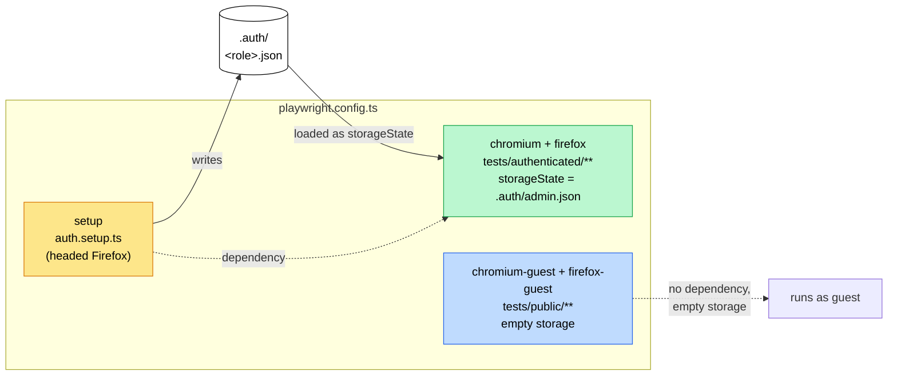
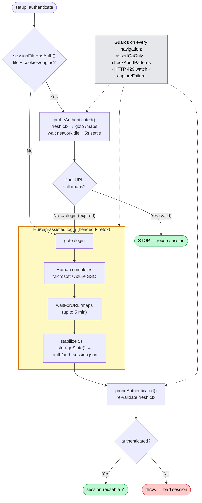

# Playwright Repo — How It Works

> Overview of the `playwright/` end-to-end test package for VannBrosPhaseTwo, with focus on the
> **auth flow** (the part that's easy to get confused by). Target app: QA env
> `https://agrierp-vann-qa.folio3.site` (tenant "Vann Brothers" / VBS).

---

## 1. The Playwright projects

`playwright.config.ts` defines **five** projects. Each project decides *which* specs run,
*what* browser storage they start with, and *whether* they need a prior login.

| Project | Spec match | Storage state | Depends on | Purpose |
| --- | --- | --- | --- | --- |
| `setup` | `auth.setup.ts` | empty (`{ cookies: [], origins: [] }`) | — | Logs in once **per role**, writing `.auth/<role>.json`. Runs **headed** (visible Firefox) so a human can complete Microsoft/Azure SSO. |
| `chromium` | `tests/authenticated/**` | loads `.auth/admin.json` | `setup` | Primary engine. The regression workbook scopes the web suite to a "Chromium based Browser". |
| `firefox` | `tests/authenticated/**` | loads `.auth/admin.json` | `setup` | Second engine. The suite was authored and verified here, and the loader/toast interception behaviour in `base.page.ts` was characterised against it. |
| `chromium-guest` | `tests/public/**` | empty | — | Unauthenticated specs (login page loads, protected route redirects to `/login`). |
| `firefox-guest` | `tests/public/**` | empty | — | Same, second engine. |

Key idea: **the authenticated projects never log in themselves.** They depend on `setup`,
which produces the session files. Authenticated specs inherit the stored cookie/origin state.

### Roles

`.auth/` holds one storage state **per actor**, not one per suite — `admin.json`,
`supervisor.json`, `farmhand.json` and so on, registered in `tests/constants/roles.ts` from
the workbook's `Test Data & Env` > "Accounts required" table.

The projects above default to `admin`. A spec that must assert what a *lower-privileged* user
cannot do overrides that for its own file:

```ts
import { asRole } from '../helpers/roleSession';

test.describe('Work order delete permissions', () => {
  asRole('farmhand');
  test('@TC:WP-057 Delete is not available to an unauthorised user', async ({ page }) => { ... });
});
```

`asRole()` **skips** the block when that role has no session on this machine, rather than
failing: `.auth/` is gitignored, so a checkout holding only `admin` is normal. Bootstrap more
with:

```bash
AUTH_ROLES=supervisor,farmhand pnpm auth:qa   # in order, serially
AUTH_ROLES=all pnpm auth:qa                   # every role that can hold a session
```

Only `admin` is bootstrapped by default, so the plain `pnpm auth:qa` workflow is unchanged.
A pre-existing `.auth/auth-session.json` is renamed to `.auth/admin.json` on the first run —
no re-login needed.

### Credentials, and why sign-in is no longer manual

When a credential is available, `auth.setup.ts` drives the sign-in itself and no human is
involved — verified against the QA tenant on 2026-08-31: **~45s, headless, unattended**.
Credentials come from, in order:

1. `VANNBROSPHASETWO_<ROLE>_USER` / `VANNBROSPHASETWO_<ROLE>_PASS` environment variables (what
   CI uses; the pre-rename `AGRIERP_<ROLE>_*` names still work).
2. `.auth/credentials.json` — local, gitignored, produced once by `pnpm creds:import` from
   the QA team's account list.

Nothing in the test code reads the repo-root `creds.txt`. That file held ~30 QA passwords and
was untracked but **not** gitignored — one `git add -A` from being published. It is ignored
now, and `pnpm creds:import` exists so it can be moved out of the repo entirely.

The scripted sign-in is **best-effort**. It walks four steps:

1. VannBrosPhaseTwo `/login` — Email, then **Login**.
2. The auth gateway's **Choose Environment** dialog. One host serves `Vann Brothers - QA`,
   `Vann Brothers - Dev` and `AgriERP D365 Internal - Demo`, so the environment is pinned by
   `QA_ENVIRONMENT_LABEL` in `constants/routes.ts`. This matters: choosing wrongly would
   authenticate against Dev while `assertQaOnly` still passed, because that guard checks the
   *host* and all three share one.
3. Azure AD — email (when re-prompted) and password.
4. "Stay signed in?", when the tenant shows it.

Anything else — MFA, consent, an account picker — makes it give up quietly and fall through
to the same `waitForURL('/maps')` the human-assisted flow always used, so an unrecognised
screen just means the operator finishes it in the visible window. That is why the `setup`
project stays **headed** by default; set `AUTH_HEADLESS=1` when the credential path is known
to complete unattended.

The `inactive` role deliberately has **no** session: it is the deactivated account behind
GN-007, expected to be refused at sign-in, so it is driven live from the login page by the
spec that asserts the refusal.



---

## 2. The auth flow (the confusing part)

The `setup` project runs `tests/auth.setup.ts`. It does **not** blindly log in every time.
It first tries to **reuse** an existing session, and only falls back to a **human-assisted
login** when reuse fails. Three layers are involved:

- `tests/auth.setup.ts` — the orchestration (the `setup('authenticate', ...)` test).
- `tests/helpers/auth.ts` — the helpers: session-file check, the `/maps` probe, safety guards.
- `tests/constants/routes.ts` — URLs (`/login`, `/maps`, `/workorders`) + QA host.

### Step-by-step

1. **Has a session file?** `sessionFileHasAuth(file)` — file exists, size ≥ 10 bytes, and has
   at least one cookie or origin. Runs once per role in `AUTH_ROLES`, serially (each needs a
   human at the keyboard, so parallel login windows would be unusable).
2. **If yes → silently probe it.** `probeAuthenticated()` opens a *fresh* context with the
   stored state, navigates to `/maps`, waits for redirects to settle, then checks the URL:
   - Still on `/maps` → **session valid, stop immediately** (skip login entirely).
   - Bounced to `/login` → session expired/invalid → fall through to login.
3. **If no valid session → log in.** Opens `/login`. With a stored credential the script
   drives the four sign-in steps itself; without one (or on an MFA/consent screen) a human
   completes it in the visible window. Either way the script waits up to **5 minutes** for
   the redirect to `/maps`.
4. **Save state.** Once on `/maps`, stabilize 5s, then `context.storageState()` writes
   `.auth/<role>.json`.
5. **Re-validate.** Re-run `probeAuthenticated()` in another fresh context and assert it
   really authenticates. Guards against saving a junk session.

### Why the "settle" waits matter (the false-positive trap)

The app is an SPA with a **client-side auth guard**. An expired session will *load* `/maps`
first, then redirect to `/login` **after** `domcontentloaded`. If the probe read the URL too
early it would see `/maps` and falsely call the session valid. So both the probe and the
bootstrap wait (`networkidle` + a fixed `PROBE_SETTLE_MS` / `STABILIZE_MS` = 5s) before
judging the final URL. This is the fix referenced by commit `fc95944` ("fixes auth false
positive").

### Safety guards (run throughout)

- `assertQaOnly(url)` — refuses any `*.folio3.site` host that isn't the QA host. Stops the
  test from ever driving a non-QA VannBrosPhaseTwo environment.
- `checkAbortPatterns(url)` — aborts if the URL looks like a captcha / unusual-activity /
  security challenge / blocked page.
- **HTTP 429 watch** — if a `429` is seen during login or probing, abort (rate-limited).
- `captureFailure()` — on any failure, screenshot to `test-results/` for debugging.



---

## 3. Sequence view — who talks to whom

```mermaid
sequenceDiagram
    autonumber
    participant Dev as Dev / CI
    participant PW as Playwright runner
    participant Setup as auth.setup.ts
    participant FS as .auth/&lt;role&gt;.json
    participant App as QA app (/login, /maps)
    participant Human as Human (SSO)

    Dev->>PW: pnpm auth:qa  (--project=setup)
    PW->>Setup: run "authenticate"
    Setup->>FS: sessionFileHasAuth()?
    alt session file exists
        Setup->>App: probe /maps (fresh ctx, stored state)
        App-->>Setup: stays /maps  → VALID, stop
    else missing / expired
        Setup->>App: goto /login (headed)
        Setup->>Human: complete Microsoft/Azure SSO
        Human-->>App: credentials
        App-->>Setup: redirect to /maps
        Setup->>FS: write storageState
        Setup->>App: re-probe /maps → assert authenticated
    end

    Note over Dev,App: Later — actual test run
    Dev->>PW: pnpm test:authed (--project=chromium --project=firefox)
    PW->>Setup: dependency "setup" runs first (reuses/refreshes session)
    PW->>App: load FS as storageState → run tests/authenticated/** (no login)
```

---

## 4. Commands cheat-sheet

All scripts prefix `PLAYWRIGHT_SKIP_VALIDATE_HOST_REQUIREMENTS=1`.

| Command | What it does |
| --- | --- |
| `pnpm test` | Run everything (setup → both engines, authed + guest). |
| `pnpm auth:qa` | Run only `setup` — (re)generate/validate sessions. Use this when authed specs fail at login. Honours `AUTH_ROLES`. |
| `pnpm creds:import` | One-time: QA account list → gitignored `.auth/credentials.json`. |
| `pnpm test:authed` | Authenticated specs on both engines (runs `setup` first via dependency). |
| `pnpm test:chromium` / `:firefox` | A single engine. |
| `pnpm test:public` | Guest specs only, both engines. |
| `pnpm test:clean` | Everything **except** `@mutating` — use before a UAT cycle, when the shared QA env must not gain new work orders. |
| `pnpm typecheck` | `tsc --noEmit`. |
| `pnpm catalog` | Re-extract the regression workbook → `test-plans/catalog/web-cases.json`. |
| `pnpm coverage` / `:write` | Coverage against that catalogue; `--write` refreshes `test-plans/COVERAGE.md`. |
| `pnpm test:ui` / `:headed` / `:debug` | Interactive variants. |
| `pnpm seed:planned` / `seed:harvest` | **Creates real work orders on QA** as test data, e.g. `pnpm seed:planned --count 5 --plots 10 --materials 2 --resources 3 --assets 2`. Prints the new WO numbers. |
| `pnpm seed:tickets` | **Plans real harvest tickets on QA**, e.g. `pnpm seed:tickets --tickets 25 --pair "130:LIVINGSTON"` (repeat `--pair`). |

Flags and limits for all three: `scripts/seed.mts`. The `seed` project (`tests/seed/`) is only
registered while that script sets `SEED`, so `pnpm test` never runs it. Work orders go through
`WorkOrdersPage.createWorkOrder`, the same form path as the `@mutating` specs, taking the first N
rows of each picker: materials, resources and assets show 50 rows per page, so each is capped at
50, and Harvest WOs have no materials. Tickets go through `HarvestCentralPage.planTickets`, which
splits counts above the form's 100-per-plan limit and checks the pair's `No Of Planned Tickets`
rose by exactly N, since saving shows no toast.

---

## 3a. Page objects

| Object | Covers |
| --- | --- |
| `BasePage` | The truck loader (`#f3-overlay-loader`) and toast overlays that intercept clicks on every authenticated screen. |
| `HeaderPage` | Module nav, the Site/Season context selectors, the D365 shortcut, the user menu, breadcrumbs. The shared surface behind the workbook's `01 Global & Navigation` tab. |
| `ListPage` | The shared `app-f3-table` grid — columns, status chips, per-column search, sorting, paging, refresh, empty state. One widget backs Work Orders, Harvest Central, Template Management, Settings and User Management, so the seven `Global - Data Grids` cases and every module's `List - *` cases run through this. |
| `WorkOrdersPage` | The Work Orders list + Create form (all four WO types). |
| `HarvestCentralPage` | Harvest Central's field/variety grid (a `ListPage`) and its Plan Harvest Tickets panel. |

**Read `test-plans/FINDINGS.md` before writing a grid spec.** The grid has four behaviours
that will silently produce wrong results otherwise: it paints skeleton rows instead of raising
the app loader, its column filters are sticky across sessions, it settles a step behind the
action, and the environment serves two different builds of its column labels. `ListPage`
absorbs all four; a spec that reaches around it will not.

---

## 4a. Traceability to the regression workbook

The QA team's `AgriFarm_VannBrothers_Regression_Suite_Web_iOS.xlsx` is the source of truth for
what "regression tested" means: 796 cases, 633 of them web-scoped, with a formula-driven
Health Summary per module. Automation is only useful to that document if a workbook row can
be traced to a test.

Specs therefore carry the workbook's own IDs in the test title:

| Tag | Meaning |
| --- | --- |
| `@TC:WT-001` | The test asserts the **whole** of that case's expected result. |
| `@TC-partial:WP-049` | The flow is automated but part of the expected result is unasserted — WP-049 wants "status changes to To Do"; the test only checks the success toast. |

Partials do **not** count towards the covered percentage. A half-asserted case will not catch
the regression it exists to catch, and folding it into the headline number would hide the gap.

Because these are ordinary Playwright tags, `--grep @TC:WT-001` runs exactly that workbook row.

`pnpm coverage` prints the per-module table and exits non-zero when a tag matches no workbook
case (a typo or a stale ID) — CI runs it, so the traceability link cannot rot silently.
`pnpm catalog` regenerates the catalogue when the workbook's *scope* changes; it deliberately
does not carry the Status column, which is the QA team's per-cycle execution record.

---

## 5. TL;DR on the auth confusion

- **`setup` is the only thing that logs in.** It's a separate Playwright project, run first.
- It **reuses** `.auth/<role>.json` whenever that session still authenticates against
  `/maps` — login is skipped silently.
- It only opens a **visible browser for a human SSO** when there's no valid session.
- **`chromium`/`firefox` (the real tests) never log in** — they just load the saved session as
  `storageState` and run.
- The 5-second "settle" waits exist because the SPA redirects expired sessions to `/login`
  *after* page load; reading the URL too early would falsely pass.
- If authed tests start failing on login → `pnpm auth:qa` to refresh the session. Never
  commit `.auth/`.
