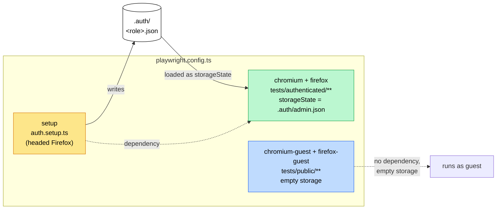
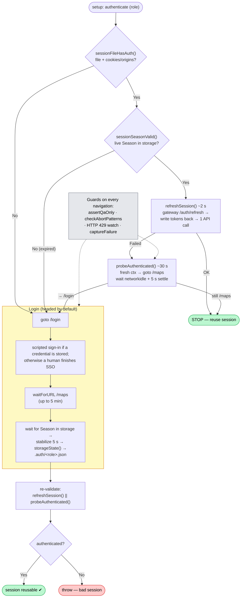

# Playwright Repo — How It Works

> Overview of the `playwright/` end-to-end test package for VannBrosPhaseTwo, with focus on the
> **auth flow** (the part that's easy to get confused by). Target app: QA env
> `https://agrierp-vann-qa.folio3.site` (tenant "Vann Brothers" / VBS).

---

## 1. The Playwright projects

`playwright.config.ts` defines **five** main projects, plus two special-purpose ones (below).
Each project decides *which* specs run, *what* browser storage they start with, and *whether*
they need a prior login.

| Project | Spec match | Storage state | Depends on | Purpose |
| --- | --- | --- | --- | --- |
| `setup` | `auth.setup.ts` | empty (`{ cookies: [], origins: [] }`) | — | Checks or (re)creates one session **per role**, writing `.auth/<role>.json`. Usually a ~2 s token refresh; a fresh login is scripted when a credential is stored, and runs **headed** by default so a human can finish any screen the script doesn't recognise. |
| `chromium` | `tests/authenticated/**` | loads `.auth/admin.json` | `setup` | Primary engine. The regression workbook scopes the web suite to a "Chromium based Browser". |
| `firefox` | `tests/authenticated/**` | loads `.auth/admin.json` | `setup` | Second engine. The suite was authored and verified here, and the loader/toast interception behaviour in `base.page.ts` was characterised against it. |
| `chromium-guest` | `tests/public/**` | empty | — | Unauthenticated specs (login page loads, protected route redirects to `/login`). |
| `firefox-guest` | `tests/public/**` | empty | — | Same, second engine. |

Key idea: **the authenticated projects never log in themselves.** They depend on `setup`,
which produces the session files. Authenticated specs inherit the stored cookie/origin state.

The special-purpose projects:

- `triage` — `tests/public/account-triage.spec.ts`, one sign-in per QA account (~31) to find
  usable ones; rewrites `test-plans/ACCOUNT-TRIAGE.md`. Registered only while `pnpm triage:accounts` sets `TRIAGE`, so a plain `pnpm test` never runs it.
- `seed` — `tests/seed/*.seed.ts`, registered **only** while `scripts/seed.mts` sets `SEED`, so
  a plain `pnpm test` never creates data.

### Roles

`.auth/` holds one storage state **per actor**, not one per suite — `admin.json`,
`supervisor.json`, `farmhand.json` and so on, registered in `tests/constants/roles.ts` from
the workbook's `Test Data & Env` > "Accounts required" table.

The projects above default to `admin`. A spec that must assert what a *lower-privileged* user
cannot do overrides that for its own file:

```ts
import { asRole } from '../helpers/roleSession';

test.describe('Work order delete permissions', () => {
  asRole('farmhand');
  test('@TC:WP-057 Delete is not available to an unauthorised user', async ({ page }) => { ... });
});
```

`asRole()` **skips** the block when that role has no session on this machine, rather than
failing: `.auth/` is gitignored, so a checkout holding only `admin` is normal. Bootstrap more
with:

```bash
AUTH_ROLES=supervisor,farmhand pnpm auth:qa   # in order, serially
AUTH_ROLES=all pnpm auth:qa                   # every role that can hold a session
```

Only `admin` is bootstrapped by default, so the plain `pnpm auth:qa` workflow is unchanged.
A pre-existing `.auth/auth-session.json` is renamed to `.auth/admin.json` on the first run —
no re-login needed.

### Credentials, and why sign-in is no longer manual

When a credential is available, `auth.setup.ts` drives the sign-in itself and no human is
involved — verified against the QA tenant on 2026-08-31: **~45s, headless, unattended**.
Credentials come from, in order:

1. `VANNBROSPHASETWO_<ROLE>_USER` / `VANNBROSPHASETWO_<ROLE>_PASS` environment variables (what
   CI uses; the pre-rename `AGRIERP_<ROLE>_*` names still work).
2. `.auth/credentials.json` — local, gitignored, produced once by `pnpm creds:import` from
   the QA team's account list.

Nothing in the test code reads the repo-root `creds.txt`. That file held ~30 QA passwords and
was untracked but **not** gitignored — one `git add -A` from being published. It is ignored
now, and `pnpm creds:import` exists so it can be moved out of the repo entirely.

The scripted sign-in is **best-effort**. It walks four steps:

1. VannBrosPhaseTwo `/login` — Email, then **Login**.
2. The auth gateway's **Choose Environment** dialog. One host serves `Vann Brothers - QA`,
   `Vann Brothers - Dev` and `AgriERP D365 Internal - Demo`, so the environment is pinned by
   `QA_ENVIRONMENT_LABEL` in `constants/routes.ts`. This matters: choosing wrongly would
   authenticate against Dev while `assertQaOnly` still passed, because that guard checks the
   *host* and all three share one.
3. Azure AD — email (when re-prompted) and password.
4. "Stay signed in?", when the tenant shows it.

Anything else — MFA, consent, an account picker — makes it give up quietly and fall through
to the same `waitForURL('/maps')` the human-assisted flow always used, so an unrecognised
screen just means the operator finishes it in the visible window. That is why the `setup`
project stays **headed** by default; set `AUTH_HEADLESS=1` when the credential path is known
to complete unattended.

The `inactive` role deliberately has **no** session: it is the deactivated account behind
GN-007, expected to be refused at sign-in, so it is driven live from the login page by the
spec that asserts the refusal.


```mermaid
flowchart LR
    subgraph cfg["playwright.config.ts"]
        S["setup<br/>auth.setup.ts<br/>(headed Firefox)"]
        F["chromium + firefox<br/>tests/authenticated/**<br/>storageState = .auth/admin.json"]
        G["chromium-guest + firefox-guest<br/>tests/public/**<br/>empty storage"]
    end

    S -->|"writes"| AUTH[(".auth/<br/>&lt;role&gt;.json")]
    AUTH -->|"loaded as storageState"| F
    S -.->|"dependency"| F

    G -.->|"no dependency,<br/>empty storage"| GUEST["runs as guest"]

    style S fill:#fde68a,stroke:#d97706,color:#000
    style F fill:#bbf7d0,stroke:#16a34a,color:#000
    style G fill:#bfdbfe,stroke:#2563eb,color:#000
    style AUTH fill:#fff,stroke:#000,color:#000
```

---

## 2. The auth flow (the confusing part)

The `setup` project runs `tests/auth.setup.ts`. It does **not** blindly log in every time.
It first tries to **reuse** an existing session, cheapest check first, and only logs in again
when reuse fails. Three layers are involved:

- `tests/auth.setup.ts` — the orchestration (one `authenticate (<role>)` test per role).
- `tests/helpers/auth.ts` — the helpers: session-file checks, the token refresh, the `/maps`
  probe, safety guards.
- `tests/constants/routes.ts` — URLs (`/login`, `/maps`, `/workorders`) + QA host.

### Step-by-step

Runs once per role in `AUTH_ROLES`, serially (a login may need a human at the keyboard, so
parallel login windows would be unusable).

1. **Has a session file?** `sessionFileHasAuth(file)` — file exists, size ≥ 10 bytes, and has
   at least one cookie or origin. No → go to step 4.
2. **Is its Season still live?** `sessionSeasonValid(file)`. The app keeps the Site/Season
   context in localStorage as expiry-wrapped values with a short, same-day TTL, independent of
   the token. A season-expired session still authenticates but serves degraded data (the
   "Select Blocks" no-season plot picker), so it is rejected → step 4.
3. **Is the session still valid?** Two checks, cheapest first; either one passing **stops
   here** (no login):
   - `refreshSession(file)` (~2 s) — does what the app does on a 401: posts the stored
     `printToken` + `refreshToken` to the auth gateway's `/auth/refresh`
     (`agrierp-authgateway-qa-api.folio3.site`), **writes the new tokens back** into the file,
     then makes one API call with them. Each refresh spends the previous token, which is why
     the write-back matters and why an older copy of the session file stops refreshing. Side
     effect: every run starts with a fresh access token, which the `api/` client reuses.
   - `probeAuthenticated()` (~30 s, fallback if the refresh fails for any reason) — opens a
     *fresh* browser context with the stored state, navigates to `/maps`, waits for redirects
     to settle, then checks the URL: still on `/maps` → valid; bounced to `/login` → invalid.
4. **Log in.** Opens `/login`. With a stored credential the script drives the sign-in steps
   itself; without one (or on an MFA/consent screen) a human completes it in the visible
   window. Either way it waits up to **5 minutes** for the redirect to `/maps`.
5. **Save state.** Once on `/maps`, wait for the Season/Location entries to appear in storage,
   stabilize 5 s, then `context.storageState()` writes `.auth/<role>.json`. Warn loudly if the
   saved session still has no live Season.
6. **Re-validate.** `refreshSession() || probeAuthenticated()` on the saved file, and assert it
   authenticates. Guards against saving a junk session.

### Why the "settle" waits matter (the false-positive trap)

The app is an SPA with a **client-side auth guard**. An expired session will *load* `/maps`
first, then redirect to `/login` **after** `domcontentloaded`. If the browser probe read the
URL too early it would see `/maps` and falsely call the session valid. So both the probe and
the login wait (`networkidle` + a fixed 5 s settle) before judging the final URL. The token
refresh path avoids this trap entirely because it asks the API, not the page.

### Safety guards (run throughout)

- `assertQaOnly(url)` — refuses any `*.folio3.site` host that isn't the QA host. Stops the
  test from ever driving a non-QA VannBrosPhaseTwo environment.
- `checkAbortPatterns(url)` — aborts if the URL looks like a captcha / unusual-activity /
  security challenge / blocked page.
- **HTTP 429 watch** — if a `429` is seen during login or probing, abort (rate-limited).
- `captureFailure()` — on any failure, screenshot to `test-results/` for debugging.


```mermaid
flowchart TD
    Start(["setup: authenticate (role)"]) --> Has{"sessionFileHasAuth()<br/>file + cookies/origins?"}

    Has -->|No| Boot
    Has -->|Yes| Season{"sessionSeasonValid()<br/>live Season in storage?"}
    Season -->|"No (expired)"| Boot
    Season -->|Yes| Refresh["refreshSession() ~2 s<br/>gateway /auth/refresh →<br/>write tokens back → 1 API call"]

    Refresh -->|OK| Done(["STOP — reuse session"])
    Refresh -->|Failed| Probe1["probeAuthenticated() ~30 s<br/>fresh ctx → goto /maps<br/>wait networkidle + 5 s settle"]
    Probe1 -->|"still /maps"| Done
    Probe1 -->|"→ /login"| Boot

    subgraph BootGrp["Login (headed by default)"]
        Boot["goto /login"] --> Sign["scripted sign-in if a credential is stored;<br/>otherwise a human finishes SSO"]
        Sign --> WaitMaps["waitForURL /maps<br/>(up to 5 min)"]
        WaitMaps --> Save["wait for Season in storage →<br/>stabilize 5 s → storageState() →<br/>.auth/&lt;role&gt;.json"]
    end

    Save --> Probe2["re-validate:<br/>refreshSession() || probeAuthenticated()"]
    Probe2 --> Assert{"authenticated?"}
    Assert -->|Yes| Done2(["session reusable ✔"])
    Assert -->|No| Fail(["throw — bad session"])

    Guards["Guards on every navigation:<br/>assertQaOnly · checkAbortPatterns<br/>· HTTP 429 watch · captureFailure"]
    Guards -.-> BootGrp
    Guards -.-> Probe1

    style Done fill:#bbf7d0,stroke:#16a34a,color:#000
    style Done2 fill:#bbf7d0,stroke:#16a34a,color:#000
    style Fail fill:#fecaca,stroke:#dc2626,color:#000
    style BootGrp fill:#fef9c3,stroke:#d97706
    style Guards fill:#e5e7eb,stroke:#6b7280,color:#000
```

---

## 3. Sequence view — who talks to whom

```mermaid
sequenceDiagram
    autonumber
    participant Dev as Dev / CI
    participant PW as Playwright runner
    participant Setup as auth.setup.ts
    participant FS as .auth/&lt;role&gt;.json
    participant App as QA app (/login, /maps)
    participant GW as Auth gateway
    participant Human as Human (only if needed)

    Dev->>PW: pnpm auth:qa  (--project=setup)
    PW->>Setup: run "authenticate"
    Setup->>FS: sessionFileHasAuth()?
    alt session file exists, Season live
        Setup->>GW: POST /auth/refresh (stored tokens)
        GW-->>Setup: new tokens → written back to FS
        Setup->>GW: one API call → OK → VALID, stop
        opt refresh failed
            Setup->>App: probe /maps (fresh ctx, stored state)
            App-->>Setup: stays /maps → VALID, stop
        end
    else missing / Season expired / invalid
        Setup->>App: goto /login (headed by default)
        Setup->>App: scripted sign-in (stored credential)
        Human-->>App: finishes any unrecognised screen (MFA, consent)
        App-->>Setup: redirect to /maps
        Setup->>FS: write storageState
        Setup->>GW: re-validate (refresh, else /maps probe) → assert authenticated
    end

    Note over Dev,App: Later — actual test run
    Dev->>PW: pnpm test:authed (--project=chromium --project=firefox)
    PW->>Setup: dependency "setup" runs first (reuses/refreshes session)
    PW->>App: load FS as storageState → run tests/authenticated/** (no login)
```

---

## 4. Page objects

| Object | Covers |
| --- | --- |
| `BasePage` | The truck loader (`#f3-overlay-loader`) and toast overlays that intercept clicks on every authenticated screen. |
| `HeaderPage` | Module nav, the Site/Season context selectors, the D365 shortcut, the user menu, breadcrumbs. The shared surface behind the workbook's `01 Global & Navigation` tab. |
| `ListPage` | The shared `app-f3-table` grid — columns, status chips, per-column search, sorting, paging, refresh, empty state. One widget backs Work Orders, Harvest Central, Template Management, Settings and User Management, so the seven `Global - Data Grids` cases and every module's `List - *` cases run through this. |
| `WorkOrdersPage` | The Work Orders list + Create form (all four WO types). |
| `HarvestCentralPage` | Harvest Central's field/variety grid (a `ListPage`) and its Plan Harvest Tickets panel. |

**Read `test-plans/FINDINGS.md` before writing a grid spec.** The grid has four behaviours
that will silently produce wrong results otherwise: it paints skeleton rows instead of raising
the app loader, its column filters are sticky across sessions, it settles a step behind the
action, and the environment serves two different builds of its column labels. `ListPage`
absorbs all four; a spec that reaches around it will not.

---

## 5. Traceability to the regression workbook

The QA team's `AgriFarm_VannBrothers_Regression_Suite_Web_iOS.xlsx` is the source of truth for
what "regression tested" means: 796 cases, 633 of them web-scoped, with a formula-driven
Health Summary per module. Automation is only useful to that document if a workbook row can
be traced to a test.

Specs therefore carry the workbook's own IDs in the test title:

| Tag | Meaning |
| --- | --- |
| `@TC:WT-001` | The test asserts the **whole** of that case's expected result. |
| `@TC-partial:WP-049` | The flow is automated but part of the expected result is unasserted — WP-049 wants "status changes to To Do"; the test only checks the success toast. |

Partials do **not** count towards the covered percentage. A half-asserted case will not catch
the regression it exists to catch, and folding it into the headline number would hide the gap.

Because these are ordinary Playwright tags, `--grep @TC:WT-001` runs exactly that workbook row.

`pnpm coverage` prints the per-module table and exits non-zero when a tag matches no workbook
case (a typo or a stale ID) — CI runs it, so the traceability link cannot rot silently.
`pnpm catalog` regenerates the catalogue when the workbook's *scope* changes; it deliberately
does not carry the Status column, which is the QA team's per-cycle execution record.

---

## 6. Commands

All test scripts prefix `PLAYWRIGHT_SKIP_VALIDATE_HOST_REQUIREMENTS=1`. The everyday ones:

| Command | What it does |
| --- | --- |
| `pnpm auth:qa` | Run only `setup` — check/refresh or (re)create sessions. Use when authed specs fail at login or the API token expired. Honours `AUTH_ROLES`. |
| `pnpm test:fast` | Daily loop: Firefox only, no retries. |
| `pnpm auth:uat` · `pnpm test:smoke:uat` | Same setup / smoke run against **UAT** (`TARGET_ENV=uat`): UAT host and gateway from `tests/constants/routes.ts`, session `.auth/uat-admin.json`, Dummy Resources v2 specs skipped. `test:smoke:uat:all` adds `@mutating`. |
| `pnpm test:clean` | Both engines, everything **except** `@mutating` — before a UAT cycle, when the shared QA env must not gain new work orders. |
| `pnpm test:authed` / `test:public` | Authenticated / guest specs, both engines. `test:chromium` / `test:firefox` for one engine. |
| `pnpm typecheck` · `pnpm coverage` | Type check; workbook coverage (fails on an unknown `@TC` tag). |

The full list — seeding real QA data (`seed:planned`, `seed:harvest`, `seed:tickets`), API
cleanup (`wo:delete`, `api:smoke`), the smoke checklist (`smoke:*`, `test:smoke`),
`test:upcoming`, `triage:accounts`, `creds:import` — with flags and caveats is in the
`vannbrosphasetwo-playwright` skill (`.claude/skills/vannbrosphasetwo-playwright/SKILL.md`,
§ Commands). Seed flags and limits: `scripts/seed.mts`. Work orders are seeded through
`WorkOrdersPage.createWorkOrder`, the same form path as the `@mutating` specs; tickets through
`HarvestCentralPage.planTickets`, which splits counts above the form's 100-per-plan limit.

---

## 7. TL;DR on the auth confusion

- **`setup` is the only thing that logs in.** It's a separate Playwright project, run first.
- It **reuses** `.auth/<role>.json` whenever the Season is still live and the session still
  authenticates — normally via a ~2 s token refresh, falling back to a ~30 s `/maps` probe.
  Login is skipped silently.
- It only **logs in again** when there's no valid session — scripted when a credential is
  stored, with a visible window so a human can finish anything the script doesn't recognise.
- **`chromium`/`firefox` (the real tests) never log in** — they just load the saved session as
  `storageState` and run.
- The 5-second "settle" waits exist because the SPA redirects expired sessions to `/login`
  *after* page load; reading the URL too early would falsely pass.
- If authed tests start failing on login, or on missing data with a "Season details not found
  in storage" warning → `pnpm auth:qa`. Never commit `.auth/`.
